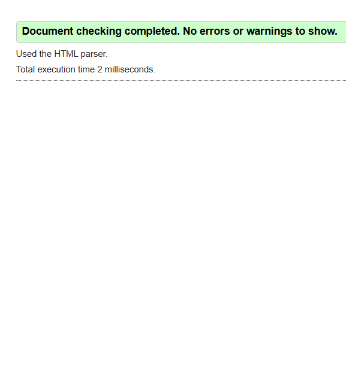

Câu A1:
1. type="password" -> Ô nhập text nhưng ký tự bị ẩn -> Tự kiểm tra độ dài tối thiểu, ký tự đặc biệt, số  -> Nhập mật khẩu tài khoản khách hàng
2. type="number" -> Ô nhập có nút tăng/giảm -> Chỉ cho nhập số, giới hạn min/max -> Nhập số lượng sản phẩm trong giỏ hàng
3. type="tel" -> Ô nhập text trên bàn phím số trên mobile -> Có thể gợi ý format số điện thoại (VN: +84) -> Nhập số điện thoại người dùng
4. type="url" -> Ô nhập text -> Tự kiểm tra định dạng (http/https) -> Nhập link website của người bán
5. type="date -> Picker chọn ngày -> Kiểm tra định dạng ngày hợp lệ thuộc giới hạn -> Chọn ngày giao/nhận hàng
6. type="time" -> Picker chọn giờ -> Kiểm tra định dạng khung giờ hợp lệ -> Chọn giờ giao/nhận hàng
7. type="range" -> Thanh trượt (slider) -> Giới hạn trong khoảng min-max/ khoảng cách -> Lọc sản phẩm theo giá tiền
8. type="checkbox" ->  Ô tick chọn có/không, có thể tick nhiều -> Không có validation tự động -> Chọn theo tiêu chí hoặc chấp thuận điều khoản(category, agree terms)
9. type="radio" -> Nút tròn, chỉ có chọn 1 trong nhiều -> Không validation tự động(trừ required) -> Chọn phương thức thanh toán
10. type="color" -> Picker chọn màu -> Không validation tự động -> Chọn màu sản phẩm

Câu A2:
    <!-- Trường hợp 1 -->
<input type="text" required value="">: Thất bại, thuộc tính "required" bắt buộc trường nhập liệu không được để trống
    <!-- Trường hợp 2 -->
<input type="email" value="abc">: Thất bại, type="email" yêu cầu nội dung phải tuân theo định dạng phải có kí tự @
    <!-- Trường hợp 3 -->
<input type="number" min="1" max="10" value="15">: Thất bại, ô nhập số giới hạn giá trị số trong khoảng [1,10]
    <!-- Trường hợp 4 -->
<input type="text" pattern="[0-9]{10}" value="abc123">: Thất bại, thuộc tính yêu cầu dữ liệu nhập vào phải khớp hoàn toàn, chuỗi user nhập vừa chứa chữ cái, vừa không đủ độ dài quy định
    <!-- Trường hợp 5 -->
<input type="password" minlength="8" value="123">: Thất bại, thuộc tính quy định chuỗi nhập vào phải dài tối thiểu 8 ký tự 

    Kết quả validation thực tế:

Câu A3:
1. Tại sao <label for="email"> quan trọng cho người dùng screen reader?
    Khi người khiếm thị sử dụng screen reader và dùng phím Tab để di chuyển qua các ô nhập liệu, trình đọc sẽ đọc nội dung bên trong thẻ <label>. Nếu không có cặp thuộc tính for/id, trình đọc sẽ chỉ báo đây là ô nhập văn bản, khiến người dùng không biết ô đó yêu cầu nhập thông tin gì (email, họ tên,...)
2. Khi nào dùng <fieldset> + <legend>? Cho ví dụ cụ thể.
    Khi form của bạn có nhiều phần khác nhau (thông tin cá nhân, địa chỉ, thanh toán) hoặc khi có một nhóm các lựa chọn (radio button,checkbox)
    VD: <fieldset>
            <legend>Chọn phương thức thanh toán</legend>
            <input type="radio" id="paypal" name="payment" value="paypal">
            <label for="paypal">PayPal</label>
            <input type="radio" id="creditcard" name="payment" value="creditcard">
            <label for="creditcard">CreditCard</label>
        </fieldset>
3. aria-label dùng khi nào? Tại sao KHÔNG nên dùng aria-label khi đã có <label>?
    aria-label được dùng khi giao diện không có văn bản hiển thị trên màn hình để mô tả cho phần tử đó, nhưng chúng ta vẫn cần cung cấp thông tin cho công cụ
    Việc sử dụng cả aria-label cùng với <label> sẽ khiến cho nội dung bị ghi đè, khi đó trình đọc màn hình sẽ không đọc được cả 2

Câu A4:
1. Giải thích thuộc tính loading="lazy" trên thẻ . Nó cải thiện gì? Khi nào KHÔNG nên dùng?
    Tải ảnh khi user scroll đến -> trang load nhanh hơn 
    Không lazy load ảnh hero, logo, ảnh đầu tiên user thấy. Chỉ nên lazy load những ảnh bên dưới
2. Tại sao nên cung cấp nhiều <source> trong thẻ <video>? Liệt kê ít nhất 3 format video web phổ biến.
    Không phải mọi trình duyệt đều hỗ trợ tất cả các định dạng video. Ngoài ra 1 số định dạng như WebM có dung lượng nhỏ hơn, người dùng có thể dự phòng thêm 1 file MP4 để tiết kiệm băng thông
    MP4(được hỗ trợ gần như 100% bởi các trình duyệt), WebM(dùng cực tốt trên Chrome,Edge), Ogg(đã từng phổ biến trên FireFox và Opera)
3. Thuộc tính alt trên  dùng để làm gì? Viết alt tốt cho 3 trường hợp
   Screen Reader sẽ đọc nội dung alt để mô tả hình ảnh cho người dùng khiếm thị, ngoài ra còn giúp hiện thị nội dung khi lỗi tải ảnh do đường truyền yếu
   + alt="Mặt sau điện thoại iPhone 16 màu đen"
   + alt=""
   + alt="Biểu đồ cột doanh thu Q1/2026, đạt mốc 3 tỷ doanh thu"

Câu A5:
Cách 1 sử dụng thẻ  khi hình ảnh chỉ có vai trò là hình minh hoạ hoặc bổ trợ cho văn bản
Cách 2 sử dụng thẻ <figure> + <figcaption> khi hình ảnh là 1 nội dung độc lập, luôn có chú thích đi kèm 
VD:
+ C1: 1 bức ảnh minh hoạ cho 1 đoạn văn cụ thể, nơi bức ảnh chỉ để bổ trợ thông tin cho đoạn văn bản 
    
+ C2: Trên các sàn thương mại điện tử sẽ có các sản phẩm nổi bật được hiển thị ảnh sản phẩm kèm tên và giá tiền
    <figure>
    
    <figcaption>
    <h3>iPhone 16 Pro</h3>
    
<strong>Giá: 28.690.000đ</strong>

    </figcaption>
    </figure>

Câu B1:
Form đăng ký có 2 trường password:
+ Password: <input type="password" id="password" name="password">
+ Xác nhận Password: <input type="password" id="confirm_password" name="confirm_password">
Lí do HTML không thể validate confirm password:
  - Mỗi input element được validate riêng lẻ theo các thuộc tính của nó (required, minlength, pattern, type...)
  - Không có cơ chế nào trong HTML để so sánh giá trị giữa 2 input khác nhau
  - HTML không thể tham chiếu giá trị của input này để so sánh với input khác

Câu C1:
Lỗi 1: Dòng 2 — Input "Tên" không có <label for="...">, vi phạm accessibility
Sửa:
<label for="name">Tên:</label> 
<input type="text" id="name" name="name" required>

Lỗi 2: Dòng 4 — Input email không có <label>, chỉ dùng placeholder nên không đảm bảo accessibility
Sửa:
<label for="email">Email:</label>
<input type="email" id="email" name="email" placeholder="Email của bạn" required>

Lỗi 3: Dòng 6 — Input mật khẩu không có <label>
Sửa:
<label for="password">Mật khẩu:</label>
<input type="password" id="password" name="password" required>

Lỗi 4: Dòng 7 — Input nhập lại mật khẩu không có <label>
Sửa:
<label for="confirm-password">Nhập lại mật khẩu:</label>
<input type="password" id="confirm-password" name="confirm-password" required>

Lỗi 5: Dòng 9 — Input số điện thoại dùng type="text" thay vì type="tel"
Sửa:
<label for="phone">Phone:</label>
<input type="tel" id="phone" name="phone" value="0901234567">

Lỗi 6: Dòng 11 — <select> không có <label> liên kết
Sửa:
<label for="city">Thành phố:</label>
<select id="city" name="city">
    <option>Hà Nội</option>
    <option>TP.HCM</option>
</select>

Lỗi 7: Dòng 16 — Checkbox điều khoản bị thiếu <input type="checkbox">
Sửa:
<label>
    <input type="checkbox" name="terms" required>
    Tôi đồng ý điều khoản
</label>

Lỗi 8: Dòng 19 — Nút submit dùng input type="submit" kém semantic hơn <button>
Sửa:
<button type="submit">Gửi</button>

Câu C2:
1. Regex cho các trường:
   - CMND/CCCD: <input type="text" name="id-number" pattern="^\d{12}$" required>  (đúng 12 chữ số)
   - Số tài khoản: <input type="text" name="account-number" pattern="^\d{10,15}$" required>  (10-15 chữ số)
2. HTML5 validation không đủ an toàn cho ứng dụng ngân hàng.
   - HTML5 chỉ kiểm tra phía trình duyệt, vì vậy người dùng hoặc hacker có thể dễ dàng bỏ qua bằng cách tắt JavaScript, chỉnh sửa DOM, dùng DevTools hoặc gửi request trực tiếp
   - Với ngân hàng, bắt buộc phải validate phía Backend vì backend mới là nguồn tin cậy, kiểm soát được dữ liệu thực và bảo vệ hệ thống với database

3. Ba loại validation mà HTML5 không thể làm được (dùng JavaScript):
   - So sánh giữa các trường: xác nhận PIN/password, xác thực hai lần nhập giống nhau.
   - Kiểm tra nghiệp vụ/async: kiểm tra tài khoản/email đã tồn tại, kiểm tra số dư, kiểm tra số tài khoản hợp lệ với cơ chế checksum hoặc xác thực bên hệ thống ngân hàng.
   - Logic phức tạp: tính tuổi từ ngày sinh, kiểm tra ngày giao dịch hợp lệ, kiểm tra định dạng đặc thù không thể biểu diễn bằng regex đơn giản.

4. Hai rủi ro bảo mật khi chỉ validate phía Frontend và không validate Backend:
   - Kẻ tấn công có thể gửi dữ liệu giả mạo trực tiếp đến server, dẫn đến tạo tài khoản giả, vượt qua kiểm tra bảo mật và có thể gây ra SQL injection/XSS nếu backend không kiểm tra kỹ.
   - Dữ liệu không hợp lệ hoặc độc hại có thể đi vào hệ thống, làm hỏng logic ứng dụng, gây lỗi nghiệp vụ hoặc lộ thông tin nhạy cảm, vì frontend không thể được xem là đáng tin cậy.