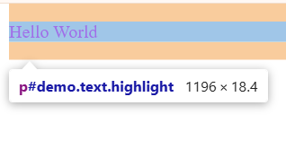

Câu A1 — 3 Cách nhúng CSS:
1. Inline CSS (CSS trực tiếp trong thẻ)
- Ví dụ: 
Văn bản

- Ưu điểm: Tiện lợi khi cần test nhanh hoặc áp dụng một style duy nhất, có độ ưu tiên cực cao. Nhược điểm: Làm code HTML bị rối, khó bảo trì, không tái sử dụng được code CSS
- Khi nào nên dùng: Khi cần sửa nhanh một thuộc tính đặc biệt cho một phần tử duy nhất hoặc khi viết code cho Email HTML.

2. Internal CSS (CSS trong thẻ 
- Ưu điểm: Toàn bộ CSS của trang nằm tập trung tại một chỗ, dễ quản lý hơn Inline CSS trong phạm vi trang đó. Nhược điểm: Chỉ có tác dụng trên một trang HTML duy nhất, khiến file HTML dài dòng hơn
- Khi nào nên dùng: Khi xây dựng một trang web độc lập không dùng chung giao diện với trang khác

3. External CSS (CSS từ file riêng biệt .css)
- Ví dụ: Thẻ nhúng trong <head>: <link rel="stylesheet" href="style.css">
- Ưu điểm: Tách biệt hoàn toàn mã HTML và CSS, có thể tái sử dụng file CSS cho nhiều trang web khác nhau, giúp tối ưu tốc độ tải trang nhờ bộ nhớ đệm (cache) của trình duyệt. Nhược điểm: Tốn thêm một yêu cầu HTTP (HTTP Request) để tải file CSS về (tuy nhiên không đáng kể).
- Khi nào nên dùng: Đây là cách tiêu chuẩn, luôn được khuyến nghị dùng cho mọi dự án thực tế lớn nhỏ

4. Trả lời câu hỏi thêm:
Nếu một phần tử chịu tác động đồng thời của cả 3 cách nhúng, cách nhúng Inline CSS sẽ "thắng"
Giải thích: Theo quy tắc Cascade và Specificity của CSS, Inline CSS có độ ưu tiên cao nhất (chỉ xếp sau !important), do nó tác động trực tiếp vào thuộc tính style của phần tử và có khoảng cách gần phần tử nhất so với Internal hay External.

Câu A2:
1. h1                           → Chọn: ShopTLU
2. .price                       → Chọn: cả 2 thẻ p: 25.990.000đ và 45.990.000đ
3. #app header                  → Chọn: toàn bộ khối <header> bên trong (bao gồm chữ: ShopTLU Home Products About)
4. nav a:first-child             → Chọn: Home
5. .product.featured h2         → Chọn: MacBook Pro
6. article > p                  → Chọn: cả 4 thẻ p nằm trực tiếp trong 2 thẻ article: 25.990.000đ, Mô tả sản phẩm..., 45.990.000đ, Mô tả sản phẩm...
7. a[href="/"]                  → Chọn: Home
8. .top-bar.dark h1              → Chọn: ShopTLU

Câu A3: 
/* Trường hợp 1: content-box (mặc định) */
.box-1 {
    width: 400px;
    padding: 20px;
    border: 5px solid black;
    margin: 10px;
}
→ Chiều rộng hiển thị = 450px
→ Không gian chiếm trên trang = 470px

/* Trường hợp 2: border-box */
.box-2 {
    box-sizing: border-box;
    width: 400px;
    padding: 20px;
    border: 5px solid black;
    margin: 10px;
}
→ Chiều rộng hiển thị = 400px
→ Kích thước content thực tế = 350px
→ Không gian chiếm trên trang = 420px

/* Trường hợp 3: Margin collapse */
.box-a { margin-bottom: 25px; }
.box-b { margin-top: 40px; }
→ Khoảng cách giữa box-a và box-b = 40px
→ Giải thích tại sao KHÔNG PHẢI 65px: Khi hai phần tử khối (block elements) xếp chồng dọc sát nhau, hiện tượng Margin Collapse (đổ sập lề dọc) sẽ xảy ra. Thay vì cộng dồn lề (25px + 40px), trình duyệt sẽ so sánh và lấy giá trị lề lớn nhất là 40px làm khoảng cách chung giữa hai hộp

- Nâng cao: Khoảng cách là 30px
→ Giải thích: Theo đặc tả CSS, khi có sự kết hợp giữa lề dương (40px) và lề âm (-10px), khoảng cách thực tế sẽ là kết quả của phép cộng đại số giữa lề dương lớn nhất và lề âm nhỏ nhất: 40px + (-10px) = 30px

Câu A4:
1. Tính specificity score (ID, Class, Element):
Rule A (p): Score = (0, 0, 1) (1 thẻ element)
Rule B (.price): Score = (0, 1, 0) (1 class)
Rule C (#main-price): Score = (1, 0, 0) (1 ID)
Rule D (p.price): Score = (0, 1, 1) (1 class + 1 element)

2. Kết quả hiển thị:
Element sẽ có màu đỏ (red)
→ Giải thích: Rule C sở hữu ID selector nên có điểm độ ưu tiên cao nhất (1, 0, 0)

3. Nếu thêm Inline Style (style="color: orange;"):
Element sẽ đổi sang màu cam (orange) vì Inline Style có độ ưu tiên vượt trội hơn

4. Nếu Rule A thêm !important:
Element sẽ đổi sang màu đen (black)
→ Giải thích: Từ khóa !important là một cơ chế phá vỡ mọi quy tắc tính điểm độ ưu tiên thông thường, nó đè lên cả Inline Style để ép buộc thuộc tính đó được áp dụng.

Câu B1:
Các loại selector đã dùng:
- Element selector: body, header, table
- Class selector: .active
- Descendant selector: nav a, main p
- Pseudo-class selector: :hover, :nth-child(even)

Câu B2:
1. Phần 1
- Hộp 1 (content-box): Chiều rộng thực tế = 300px width + 40px padding + 10px border = 350px
- Hộp 2 (border-box): Chiều rộng thực tế = 300px width

Giải thích sự khác biệt:
- content-box(mặc định): Width chỉ tính phần chứa nội dung. Padding và border được cộng thêm vào kích thước cuối cùng
- border-box: Width bao gồm cả padding + border (không bao gồm margin)

Câu B3:
1. Liệt kê 10 rules
*{
    color: black;
}
→ Specificity: 0,0,0

p{
    color: red;
}
→ Specificity: 0,0,1

body p{
    color: blue;
}
→ Specificity: 0,0,2

.text{
    color: green;
}
→ Specificity: 0,1,0

p text{
    color: orange;
}
→ Specificity: 0,1,1

.text.highlight{
    color: purple;
}
→ Specificity: 0,2,0

p .text.highlight{
    color: brown;
}
→ Specificity: 0,2,1

#demo{
    color: pink;
}
→ Specificity: 1,0,0

p#demo{
    color: cyan;
}
→ Specificity: 1,0,1

p#demo.text.highlight{
    color: magenta;
}
→ Specificity: 1,2,1

2. Element cuối hiển thị màu magenta. Vì rule số 10 có độ ưu tiên cao nhất với specificity score là 1,2,1

3. 

4. Kết quả không thay đổi. Vì theo cơ chế của trình duyệt, các quy tắc so sánh điểm specificity luôn luôn được đặt lên hàng đầu. Quy tắc nào có điểm cao hơn sẽ giành chiến thắng tuyệt đối, thứ tự xuất hiện trước hay sau trong file CSS chỉ có ý nghĩa khi hai quy tắc có điểm specificity hoàn toàn bằng nhau